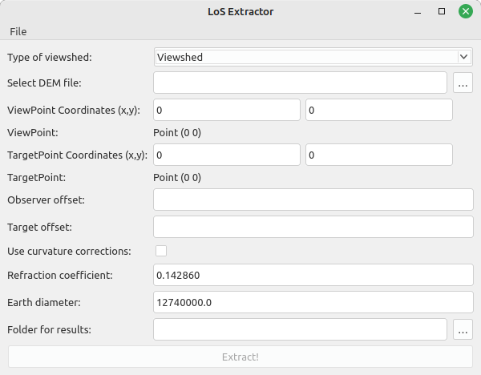

# Viewshed is a Cpp library to calculate Viewshed and extract LoS on Digital Surface Models

Library using QGIS, QT API and C++20 features to calculate visibility (viewshed), inverse visibility and additional information about it. The 
library is developed and tested on Linux.

## Status

[](https://github.com/JanCaha/cpp-viewshed-library/actions/workflows/test_library.yaml)
[](https://github.com/JanCaha/cpp-viewshed-library/actions/workflows/create_releases.yaml)

## Using the library

The core of the functionality is in the library itself that can be used directly from C++, however the project defines also couple of binaries to simply use of tool.

### Binaries

There are two command line utilies: `viewshed` and `inverseviewshed`.

```bash
Usage: viewshed [options]
Viewshed.

Options:
  -h, --help                          Displays help on commandline options.
  --help-all                          Displays help including Qt specific
                                      options.
  -v, --version                       Displays version information.
  --dem < >                           Raster file representing DEM for viewshed
                                      calculation.
  --resultsFolder < >                 Output folder to store the results in.
  --observerPosition < >              Observer position in for XXX.XX;YY.YYY .
  --heightObserver < >                Height of the observer.
  --useCurvatureCorrections <true>    Use curvature corrections?
  --refractionCoefficient <0.142860>  Refraction coefficient.
  --earthDiameter <12740000>          Earth diameter.
  --visibilityMask < >                Raster file representing visibility mask,
                                      specifying areas to calculate visibility
                                      in, for viewshed calculation.  
```

```bash
Usage: inverseviewshed [options]
InverseViewshed.

Options:
  -h, --help                          Displays help on commandline options.
  --help-all                          Displays help including Qt specific
                                      options.
  -v, --version                       Displays version information.
  --dem < >                           Raster file representing DEM for viewshed
                                      calculation.
  --resultsFolder < >                 Output folder to store the results in.
  --targetPosition < >                Target position in for XXX.XX;YY.YYY .
  --heightObserver < >                Height of the observer.
  --heightTarget <0>                  Height of the target.
  --useCurvatureCorrections <true>    Use curvature corrections?
  --refractionCoefficient <0.142860>  Refraction coefficient.
  --earthDiameter <12740000>          Earth diameter.
  --visibilityMask < >                Raster file representing visibility mask,
                                      specifying areas to calculate visibility
                                      in, for viewshed calculation.
```

Besides that there are two binaries with GUI: `viewshedcalculator` and `losextractor`. That allow calculation of viewshed (and also inversviewshed) and its characteristics, and extraction of line-of-sight in form of CSV file.




### Docker

The easiest way to test the library is using the [docker image](https://hub.docker.com/r/cahik/viewshed). The docker contains all the necessities for running the library (QGIS with dependencies including Qt and other libraries), thus its relatively bigger size.

It is probably a reasonable idea to attach the data using [docker volumes](https://docs.docker.com/storage/volumes/) to use your data inside the docker with the provided tools.

The individual command line tools can be run as:

```bash
docker run --rm -it -v /path/to/data:/path/to/data/in/docker cahik/viewshed:latest viewshed [parameters]
docker run --rm -it -v /path/to/data:/path/to/data/in/docker cahik/viewshed:latest inverseviewshed [parameters]
```

Running the GUI tools is slightly more complicated, as display has to be configured. On Linux it looks like this:

```bash
xhost +
docker run --rm -it --name viewshedcalculator \
        -v /path/to/data:/path/to/data/in/docker \
        -v /tmp/.X11-unix:/tmp/.X11-unix \
        -e DISPLAY=unix$DISPLAY cahik/viewshed:latest viewshedcalculator
xhost -

xhost +
docker run --rm -it --name losextractor \
        -v /path/to/data:/path/to/data/in/docker \
        -v /tmp/.X11-unix:/tmp/.X11-unix \
        -e DISPLAY=unix$DISPLAY cahik/viewshed:latest losextractor
xhost -
```

### Install on Linux (Debian based)

On distributions based on Debian, the tools can be installed from PPA.

```bash
sudo add-apt-repository ppa:jancaha/gis-tools
sudo apt-get update
apt-get -y install simplerasters viewshed viewshed-bin 
```

## Citation

If you use the library, please cite it accordingly:

```bibtex
@Software{Caha2024,
  author  = {Jan Caha},
  title   = {viewshed ({C++ Viewshed library based on GDAL and Qt})},
  year    = {2024},
  date    = {2024-07-11},
  version = {4.0.3},
  url     = {https://github.com/JanCaha/cpp-viewshed-library},
}
```

## Setup precommits

```bash
sudo apt-get install pre-commit
pre-commit install -f
```
